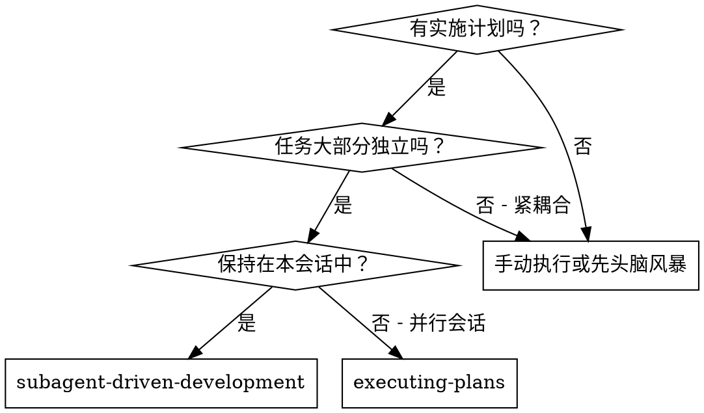
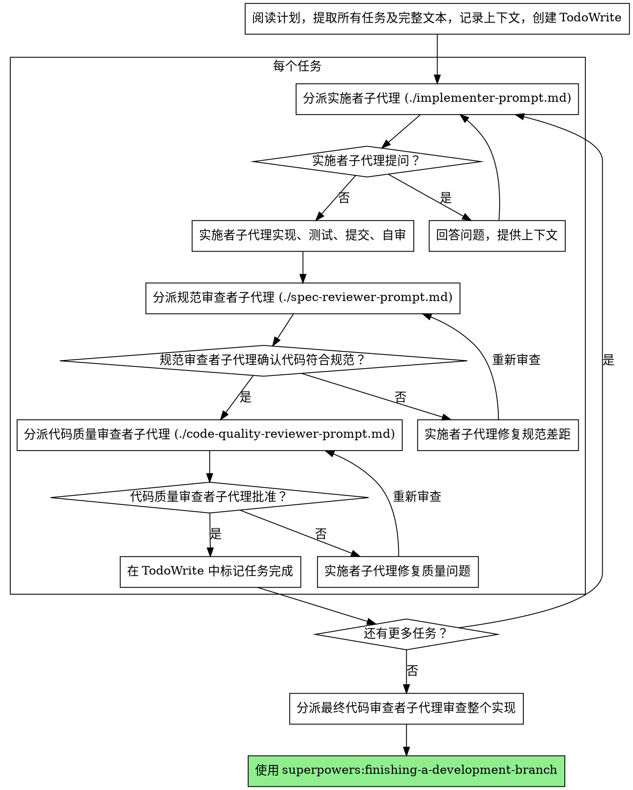

# 子代理驱动开发

通过为每个任务分派全新的子代理来执行计划，每个任务后进行两阶段审查：先进行规范一致性审查，然后进行代码质量审查。

**为什么要用子代理：** 你将任务委托给具有隔离上下文的专门代理。通过精心设计他们的指令和上下文，确保他们保持专注并成功完成任务。他们绝不应该继承你的会话上下文或历史——你构建的正是他们所需的内容。这也为你保留了用于协调工作的上下文。

**核心原则：** 每个任务使用新的子代理 + 两阶段审查（规范一致性然后质量）= 高质量、快速迭代

## 何时使用



**与 Executing Plans（并行会话）对比：**
- 同一会话（无需上下文切换）
- 每个任务使用新的子代理（无上下文污染）
- 每个任务后两阶段审查：先规范一致性，再代码质量
- 更快迭代（任务间无需人工介入）

## 流程



## 模型选择

使用能够处理每个角色的最低能力模型以节省成本并提高速度。

**机械性实现任务**（隔离的函数、清晰的规范、1-2 个文件）：使用快速、便宜的模型。当计划规范良好时，大多数实现任务都是机械性的。

**集成和判断任务**（多文件协调、模式匹配、调试）：使用标准模型。

**架构、设计和审查任务**：使用可用的最强模型。

**任务复杂度信号：**
- 涉及 1-2 个文件且有完整规范 → 便宜模型
- 涉及多个文件且有集成问题 → 标准模型
- 需要设计判断或对代码库的广泛理解 → 最强模型

## 处理实施者状态

实施者子代理报告四种状态之一。适当处理每种状态：

**完成：** 继续进行规范一致性审查。

**完成但有疑虑：** 实施者完成了工作但标记了疑虑。在继续之前阅读疑虑。如果疑虑涉及正确性或范围，在审查之前解决它们。如果它们是观察（例如"这个文件变大了"），记录下来并继续审查。

**需要上下文：** 实施者需要未提供的信息。提供缺失的上下文并重新分派。

**阻塞：** 实施者无法完成任务。评估阻塞：
1. 如果是上下文问题，提供更多上下文并使用相同模型重新分派
2. 如果任务需要更多推理，使用更强能力的模型重新分派
3. 如果任务太大，将其拆分为更小的部分
4. 如果计划本身是错误的，上报给人类

**永远不要**忽视升级或在不做更改的情况下强制相同模型重试。如果实施者说卡住了，需要有所改变。

## 提示模板

- `./implementer-prompt.md` - 分派实施者子代理
- `./spec-reviewer-prompt.md` - 分派规范一致性审查者子代理
- `./code-quality-reviewer-prompt.md` - 分派代码质量审查者子代理

## 示例工作流

```
你：我正在使用子代理驱动开发来执行此计划。

[阅读计划文件一次：docs/superpowers/plans/feature-plan.md]
[提取所有 5 个任务及其完整文本和上下文]
[创建包含所有任务的 TodoWrite]

任务 1：钩子安装脚本

[获取任务 1 的文本和上下文（已提取）]
[分派实现子代理并附带完整任务文本 + 上下文]

实施者："在我开始之前——钩子应该安装在用户级别还是系统级别？"

你："用户级别（~/.config/superpowers/hooks/）"

实施者："明白了。现在开始实现..."
[稍后] 实施者：
  - 实现了 install-hook 命令
  - 添加了测试，5/5 通过
  - 自审：发现遗漏了 --force 标志，已添加
  - 已提交

[分派规范一致性审查者]
规范审查者：✅ 符合规范 - 所有需求满足，无额外内容

[获取 git SHA，分派代码质量审查者]
代码审查者：优点：测试覆盖良好，代码清晰。问题：无。已批准。

[标记任务 1 完成]

任务 2：恢复模式

[获取任务 2 的文本和上下文（已提取）]
[分派实现子代理并附带完整任务文本 + 上下文]

实施者：[无问题，继续]
实施者：
  - 添加了验证/修复模式
  - 8/8 测试通过
  - 自审：一切正常
  - 已提交

[分派规范一致性审查者]
规范审查者：❌ 问题：
  - 缺失：进度报告（规范说"每 100 项报告一次"）
  - 额外：添加了 --json 标志（未请求）

[实施者修复问题]
实施者：移除了 --json 标志，添加了进度报告

[规范审查者再次审查]
规范审查者：✅ 现在符合规范

[分派代码质量审查者]
代码审查者：优点：扎实。问题（重要）：魔法数字（100）

[实施者修复]
实施者：提取了 PROGRESS_INTERVAL 常量

[代码审查者再次审查]
代码审查者：✅ 已批准

[标记任务 2 完成]

...

[所有任务完成后]
[分派最终代码审查者]
最终审查者：所有需求满足，准备合并

完成！
```

## 优势

**与手动执行对比：**
- 子代理自然遵循 TDD
- 每个任务全新上下文（无混淆）
- 并行安全（子代理不会干扰）
- 子代理可以提问（工作前和工作期间）

**与 Executing Plans 对比：**
- 同一会话（无需交接）
- 持续进展（无需等待）
- 审查检查点自动进行

**效率提升：**
- 无文件读取开销（控制器提供完整文本）
- 控制器精心策划所需的确切上下文
- 子代理预先获得完整信息
- 问题在工作开始前暴露（而不是之后）

**质量关口：**
- 自审在交接前发现问题
- 两阶段审查：规范一致性，然后代码质量
- 审查循环确保修复确实有效
- 规范一致性防止过度/不足构建
- 代码质量确保实现构建良好

**成本：**
- 更多子代理调用（每个任务实施者 + 2 个审查者）
- 控制器需要做更多准备工作（预先提取所有任务）
- 审查循环增加迭代
- 但早期发现问题（比后期调试更便宜）

## 红旗

**永远不要：**
- 未经用户明确同意就在 main/master 分支上开始实现
- 跳过审查（规范一致性或代码质量）
- 带着未修复的问题继续
- 并行分派多个实现子代理（会冲突）
- 让子代理阅读计划文件（改为提供完整文本）
- 跳过场景设置上下文（子代理需要了解任务适合的位置）
- 忽视子代理的问题（在他们继续之前回答）
- 接受规范一致性上的"差不多"（规范审查者发现问题 = 未完成）
- 跳过审查循环（审查者发现问题 = 实施者修复 = 再次审查）
- 让实施者自审替代实际审查（两者都需要）
- **在规范一致性通过 ✅ 之前开始代码质量审查**（顺序错误）
- 在任一审查有未解决问题时进入下一个任务

**如果子代理提问：**
- 清楚完整地回答
- 如需要，提供额外上下文
- 不要催促他们进入实现

**如果审查者发现问题：**
- 实施者（相同子代理）修复它们
- 审查者再次审查
- 重复直到批准
- 不要跳过重新审查

**如果子代理任务失败：**
- 使用具体指令分派修复子代理
- 不要尝试手动修复（上下文污染）

## 集成

**必需的工作流技能：**
- **superpowers:using-git-worktrees** - 必需：开始前设置隔离工作区
- **superpowers:writing-plans** - 创建此技能执行的计划
- **superpowers:requesting-code-review** - 审查者子代理的代码审查模板
- **superpowers:finishing-a-development-branch** - 所有任务完成后完成开发

**子代理应该使用：**
- **superpowers:test-driven-development** - 子代理为每个任务遵循 TDD

**替代工作流：**
- **superpowers:executing-plans** - 用于并行会话而非同一会话执行
