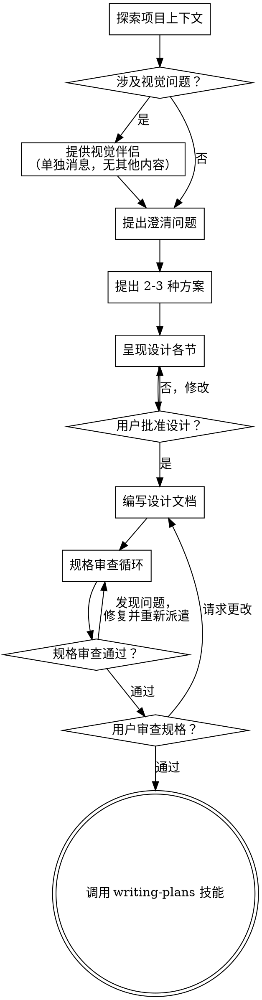

# 将想法转化为设计

帮助通过自然的协作对话将想法转化为完整的设计和规格说明。

首先了解当前项目上下文，然后一次提出一个问题来完善想法。一旦理解了要构建的内容，就呈现设计并获取用户批准。

<HARD-GATE>
在呈现设计并获得用户批准之前，不要调用任何实现技能、编写任何代码、搭建任何项目或采取任何实现行动。这适用于每一个项目，无论其看起来多么简单。
</HARD-GATE>

## 反模式："这个太简单了，不需要设计"

每个项目都要经过这个过程。待办事项列表、单功能工具、配置更改——所有这些都要。"简单"的项目正是未经审视的假设造成最多浪费工作的地方。设计可以很简短（真正简单的项目几句话即可），但你必须呈现设计并获得批准。

## 检查清单

你必须为以下每个项目创建任务并按顺序完成：

1. **探索项目上下文** —— 检查文件、文档、最近的提交
2. **提出澄清问题** —— 一次一个，理解目的/约束/成功标准
3. **提出 2-3 种方案** —— 附带权衡和你的推荐
4. **呈现设计** —— 根据复杂程度分节展示，每节后获取用户批准
5. **编写设计文档** —— 保存到 `docs/specs/YYYY-MM-DD-<topic>-design.md` 并提交
6. **规格审查循环** —— 派遣规格文档审阅者子代理，附带精心设计的审查上下文（不是你的会话历史）；修复问题并重新派遣直到通过（最多 5 次迭代，然后上报给人类）
7. **用户审查书面规格** —— 要求用户在继续之前审查规格文件
8. **过渡到实现** —— 调用 writing-plans 技能创建实现计划

## 流程图

**终止状态是调用 writing-plans。** 不要调用 frontend-design、mcp-builder 或任何其他实现技能。头脑风暴后唯一调用的技能是 writing-plans。

## 流程

**理解想法：**

- 首先检查当前项目状态（文件、文档、最近的提交）
- 在询问详细问题之前，评估范围：如果请求描述了多个独立的子系统（例如，"构建一个包含聊天、文件存储、计费和分析的平台"），立即标记这一点。不要花费问题去细化一个需要先分解的项目的细节。
- 如果项目对于一个规格来说太大，帮助用户分解为子项目：有哪些独立的模块，它们如何关联，应该按什么顺序构建？然后通过正常的设计流程头脑风暴第一个子项目。每个子项目都有自己的规格 → 计划 → 实现周期。
- 对于规模适当的项目，一次提出一个问题来完善想法
- 尽可能使用选择题，但开放式问题也可以
- 每条消息只提一个问题——如果一个话题需要更多探索，分成多个问题
- 专注于理解：目的、约束、成功标准

**探索方案：**

- 提出 2-3 种不同的方案并附带权衡
- 以对话方式呈现选项，给出你的推荐和理由
- 首先呈现你推荐的选项并解释原因

**呈现设计：**

- 一旦你理解了要构建的内容，就呈现设计
- 根据复杂程度调整每节长度：简单的话几句话，复杂的话 200-300 字
- 每节后询问到目前为止是否正确
- 涵盖：架构、组件、数据流、错误处理、测试
- 如果某处不合理，准备好回去澄清

**为隔离和清晰而设计：**

- 将系统分解为较小的单元，每个单元有明确的目的，通过定义良好的接口通信，可以独立理解和测试
- 对于每个单元，你应该能够回答：它做什么，如何使用它，它依赖什么？
- 有人能否在不阅读内部实现的情况下理解一个单元的功能？你能否在不破坏消费者的情况下更改内部实现？如果不能，边界需要重新考虑。
- 较小、边界清晰的单元也更容易处理——你对能够一次记在脑子里的代码推理得更好，当文件聚焦时你的编辑更可靠。当一个文件变得很大时，这通常是它做得太多的信号。

**在现有代码库中工作：**

- 在提出更改之前探索当前结构。遵循现有模式。
- 当现有代码存在影响工作的问题时（例如，文件变得太大、边界不清晰、职责纠缠），将针对性的改进作为设计的一部分——就像优秀的开发人员在处理的代码中进行改进一样。
- 不要提议无关的重构。专注于当前目标所需的内容。

## 设计之后

**文档：**

- 将验证过的设计（规格）写入 `docs/specs/YYYY-MM-DD-<topic>-design.md`
- 如果可用，使用 writing-clearly-and-concisely 技能
- 将设计文档提交到 git

**规格审查循环：**
编写规格文档后：

1. 派遣规格文档审阅者子代理（参见 spec-document-reviewer-prompt.md）
2. 如果发现问题：修复、重新派遣，重复直到通过
3. 如果循环超过 5 次迭代，上报给人类寻求指导

**用户审查关卡：**
规格审查循环通过后，要求用户在继续之前审查书面规格：

> "规格已编写并提交到 `<path>`。请在开始编写实现计划之前审查它，如果有任何需要修改的地方请告诉我。"

等待用户的回复。如果他们请求更改，进行更改并重新运行规格审查循环。只有在用户批准后才能继续。

**实现：**

- 调用 writing-plans 技能创建详细的实现计划
- 不要调用任何其他技能。writing-plans 是下一步。

## 关键原则

- **一次一个问题** —— 不要用多个问题压倒用户
- **优先使用选择题** —— 比开放式问题更容易回答
- **严格遵循 YAGNI** —— 从所有设计中删除不必要的功能
- **探索替代方案** —— 在确定之前总是提出 2-3 种方案
- **增量验证** —— 在继续之前呈现设计并获得批准
- **保持灵活** —— 当某处不合理时回去澄清