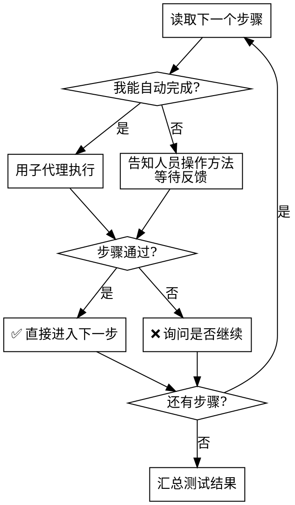

# manual-testing

## 概述

分三个阶段执行：**分析代码 → 生成清单 → 逐步引导测试**。  
核心原则：每次只走一小步，测试人员始终知道自己该做什么。

---

## 阶段一：梳理流程

收到测试目标后：

1. 使用 `mcp__gitnexus__query` 查找相关执行流程
2. 阅读核心文件（路由、服务、前端组件）
3. 向测试人员简要说明梳理出的流程（3-5 句话），确认理解无误

---

## 阶段二：生成测试清单

**格式要求：**

```markdown
> **角色设定**：xxx
> **测试目标**：xxx
> **测试前提**：xxx

---

## 一、前置准备
### 1.1 xxx
- [ ] 步骤描述

## 二、xxx流程
...

## 附录：xxx
```

**输出规则：**
- 保存到 `docs/testing-plan/{功能名}-测试清单.md`
- 区分「可自动完成」和「需要人工配合」的步骤
- 每个 section 不超过 10 个 checkbox
- 附录放技术速查（API、命令、配置值等）

生成后给测试人员两个选项：
> A. 立即开始测试  
> B. 稍后测试（清单路径：`docs/testing-plan/xxx.md`）

---

## 阶段三：逐步引导测试

**铁律：每次只执行一个步骤。**



### 需要人工配合时的话术模板

```
📋 **第 X 步：[步骤名称]**

请你执行以下操作：
1. [具体操作描述]
2. [具体操作描述]

完成后告诉我：[预期看到什么 / 发生了什么]
```

### 步骤失败时的话术模板

```
❌ **第 X 步失败**

失败原因：[描述]
期望结果：[描述]
实际结果：[描述]

是否继续后续步骤？（可能存在依赖关系）
A. 继续  B. 停止并排查
```

---

## 阶段四：汇总结果

所有步骤完成后输出：

```markdown
## 测试结果汇总

**通过：** X / Y 步骤
**失败：** X 步骤（列出步骤名）
**跳过：** X 步骤（列出步骤名）

### 失败步骤详情
- 第 N 步「xxx」：[原因]

### 结论
[整体评估：功能是否可用，是否存在阻断性问题]
```

---

## 常见错误

| 错误 | 正确做法 |
|------|---------|
| 一次性执行多个步骤 | 严格一步一步来，等待确认再继续 |
| 直接告诉结论而不等人工反馈 | 需要人工操作时必须暂停等待 |
| 子代理执行完不汇报 | 每个子代理结果必须汇报给主流程 |
| 步骤失败直接跳过 | 失败必须询问测试人员是否继续 |
| 生成清单后忘记提供链接 | 始终告知清单的文件路径 |
