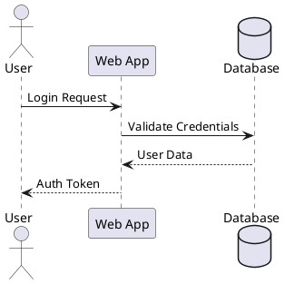
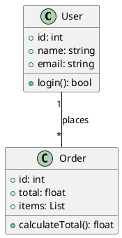
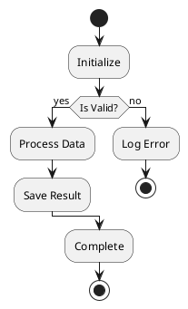
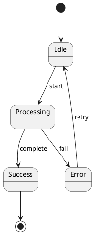
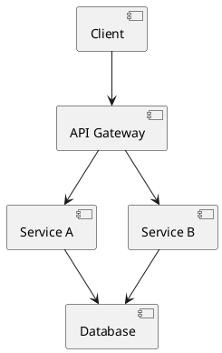
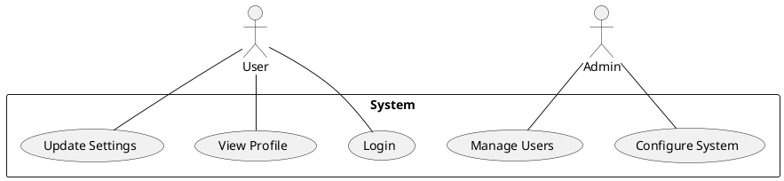
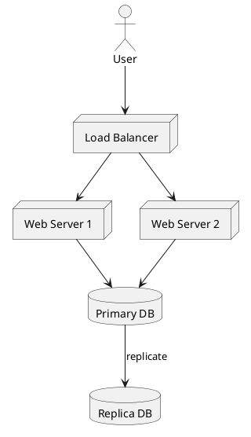

# PlantUML ASCII Art Diagram Generator

## Overview

Create text-based ASCII art diagrams using PlantUML. Perfect for documentation in terminal environments, README files, emails, or any scenario where graphical diagrams aren't suitable.

## What is PlantUML ASCII Art?

PlantUML can generate diagrams as plain text (ASCII art) instead of images. This is useful for:

- Terminal-based workflows
- Git commits/PRs without image support
- Documentation that needs to be version-controlled
- Environments where graphical tools aren't available


## Output Formats

| Flag    | Format        | Description                          |
| ------- | ------------- | ------------------------------------ |
| `-txt`  | ASCII         | Pure ASCII characters                |
| `-utxt` | Unicode ASCII | Enhanced with box-drawing characters |

## Basic Workflow

### 1. Generate ASCII Art

```bash
# Standard ASCII output
plantuml -txt diagram.puml

# Unicode-enhanced output (better looking)
plantuml -utxt diagram.puml

# Using JAR directly
java -jar plantuml.jar -txt diagram.puml
java -jar plantuml.jar -utxt diagram.puml
```

### 2. View Output

Output is saved as `diagram.atxt` (ASCII) or `diagram.utxt` (Unicode).

## Diagram Types Supported

### Sequence Diagram



### Class Diagram



### Activity Diagram



### State Diagram



### Component Diagram



### Use Case Diagram



### Deployment Diagram



## Command-Line Options

```bash
# Specify output directory
plantuml -txt -o ./output diagram.puml

# Process all files in directory
plantuml -txt ./diagrams/

# Include dot files (hidden files)
plantuml -txt -includeDot diagrams/

# Verbose output
plantuml -txt -v diagram.puml

# Specify charset
plantuml -txt -charset UTF-8 diagram.puml
```

## Tips for Better ASCII Diagrams

1. **Keep it simple**: Complex diagrams don't render well in ASCII
2. **Short labels**: Long text breaks ASCII alignment
3. **Use Unicode (`-utxt`)**: Better visual quality with box-drawing chars
4. **Test before sharing**: Verify in terminal with fixed-width font
5. **Consider alternatives**: For complex diagrams, use Mermaid.js or graphviz

## Example Output Comparison

**Standard ASCII (`-txt`)**:

```
     ,---.          ,---.
     |Bob|          |Alice|
     `---'          `---'
      |   hello      |
      |------------->|
      |              |
      |  Is it ok?   |
      |<-------------|
      |              |
```

**Unicode ASCII (`-utxt`)**:

```
┌─────┐        ┌─────┐
│ Bob │        │Alice│
└─────┘        └─────┘
  │   hello      │
  │─────────────>│
  │              │
  │  Is it ok?   │
  │<─────────────│
  │              │
```

## Quick Reference

```bash
# Create sequence diagram in ASCII
cat > seq.puml << 'EOF'
@startuml
Alice -> Bob: Request
Bob --> Alice: Response
@enduml
EOF

plantuml -txt seq.puml
cat seq.atxt

# Create with Unicode
plantuml -utxt seq.puml
cat seq.utxt
```

## Troubleshooting

**Problem**: Garbled Unicode characters

- **Solution**: Ensure terminal supports UTF-8 and has proper font

**Problem**: Diagram looks misaligned

- **Solution**: Use fixed-width font (Courier, Monaco, Consolas)

**Problem**: Command not found

- **Solution**: Install PlantUML or use Java JAR directly

**Problem**: Output file not created

- **Solution**: Check file permissions, ensure PlantUML has write access