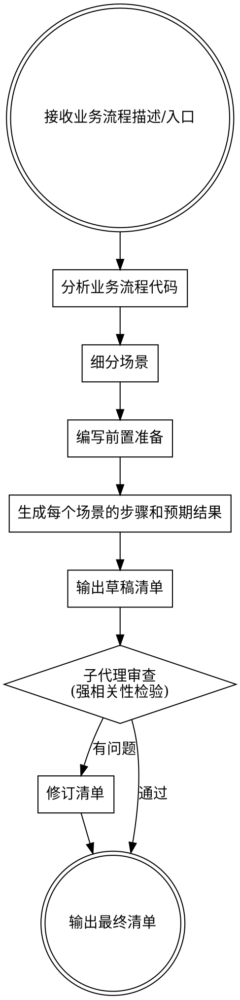

# UAT 验收清单生成技能

## 概述

为指定业务流程自动生成结构化 UAT 验收清单。通过分析代码逻辑，细分为可测试场景，并经子代理审查确保与业务流程强相关。

## 执行流程



---

## 第一步：分析业务流程代码

> **重要原则：阅读代码只为理解流程，绝不将代码细节写入清单。**
> UAT 是业务验收，执行者是业务人员或测试人员，他们只能看到界面，不会查数据库、不会看 HTTP 状态码、不会用抓包工具。

使用 GitNexus 或直接阅读代码，将技术实现**转译**为用户视角的业务分支：

- **入口点** → 用户从哪个页面、点哪个按钮触发流程
- **核心逻辑链** → 每个步骤用户看到什么、系统给出什么反馈
- **分支条件** → 不同情况下界面如何变化（成功态、错误态、加载态）
- **外部依赖** → 对用户的影响：某服务不可用时，界面显示什么提示
- **输出/副作用** → 操作完成后用户能观察到的变化（页面跳转、状态更新、提示文字）

```bash
# 推荐：使用 GitNexus 理解流程
gitnexus_query({query: "<业务流程关键词>"})
gitnexus_context({name: "<核心函数名>"})
# 或直接读取路由/服务/控制器文件
```

分析完成后，将技术分支映射为业务语言：
| 技术实现 | 业务表述 |
|---------|---------|
| HTTP 401 / Unauthorized | 页面提示"无权限"或跳转登录页 |
| DB 写入 wecom_userid | 刷新后绑定状态仍保留 |
| NetworkError → ExternalServiceError | 页面显示"服务暂时不可用，请稍后重试" |
| bindingInProgress.current 防重 | 扫码只触发一次绑定，不重复提交 |

---

## 第二步：细分场景

将业务流程按以下维度拆分为独立可测试的场景：

| 场景类型 | 说明 | 示例 |
|---------|------|------|
| **正常路径** | 最典型的成功用例 | 用户正常完成绑定 |
| **边界条件** | 极限输入、空值、最大值 | 二维码已过期 |
| **异常路径** | 系统错误、权限不足、并发 | 网络超时后重试 |
| **业务规则** | 特定约束条件的验证 | 重复绑定检测 |
| **数据一致性** | 跨系统、跨状态的数据正确性 | 绑定后用户信息同步 |

**每个场景命名格式：** `场景 N：<动词> + <主语> + <条件>`

---

## 第三步：编写前置准备

前置准备必须具体可操作，列出以下内容：

```markdown
## 前置准备

### 环境
- [ ] 测试环境可正常访问
- [ ] 所需外部服务已配置（如：企业微信应用已配置、第三方服务可用）

### 测试账号
- [ ] 账号A：<具体状态描述，如"尚未绑定企微的普通账号">
- [ ] 账号B：<具体状态描述，如"已绑定企微的账号，记录其绑定的账号 ID">
- [ ] （其他所需账号或设备，描述其状态和用途）

### 特殊场景准备
- [ ] 需开发配合模拟的环境（如：服务超时、配置缺失），提前与开发沟通
```

> **注意：** 前置准备只列业务人员能自行准备的内容。需要开发或运维操作的环境配置，只需注明"提前与开发沟通"，不要求测试人员自行操作。

---

## 第四步：生成场景步骤和预期结果

每个场景严格按以下格式输出：

```markdown
### 场景 N：<场景名称>

**目的：** 验证 <具体业务逻辑描述>

**步骤：**
- [ ] 步骤1：<具体操作> → **预期：** <具体可验证结果>
- [ ] 步骤2：<具体操作> → **预期：** <具体可验证结果>
- [ ] 步骤3：<具体操作> → **预期：** <具体可验证结果>

**通过标准：** <整体场景成功的判断依据>
```

**步骤编写规则：**
- 每个步骤必须包含"操作"和"预期结果"两部分
- 操作只写用户能做的事：点击、输入、扫码、等待、刷新页面
- 预期结果只写用户能观察到的：页面显示什么文字、出现什么提示、跳转到哪里、按钮状态如何变化
- 不写模糊词：~~"系统正常响应"~~ → 写 "页面显示'绑定成功'，并展示绑定的企微账号信息"
- 步骤粒度：每步只做一件事

**严禁写入清单的技术内容：**
- ❌ HTTP 状态码（401、422、500）
- ❌ 数据库查询（SQL、字段值验证）
- ❌ 代码变量名、函数名、API 路径
- ❌ 抓包/调试工具操作（DevTools、mitmproxy、console.log）
- ❌ 需要开发者协助才能执行的步骤（如"临时暴露方法到 window"）

> 判断标准：**一个不懂代码的业务人员，能否按此步骤独立执行？** 不能，就删掉或改写。
> 
> 需要技术手段才能复现的场景（如模拟网络超时），应注明"需开发配合模拟环境"，并作为独立场景标注，而非要求测试人员自行操作。

---

## 第五步：子代理审查

生成草稿后，**必须**派遣子代理进行审查。

### 子代理 Prompt 模板

```
你是一名资深 QA 工程师，请审查以下 UAT 验收清单。

【业务流程描述】
<将第一步分析得到的流程描述填入此处>

【待审清单】
<将草稿清单全文填入此处>

请按以下维度审查，给出具体的问题列表和修改建议：

1. **业务视角纯净性**：清单中是否出现了技术内容（HTTP 状态码、数据库查询、代码变量名、抓包工具操作、需开发协助才能执行的步骤）？全部标出并给出业务化改写建议
2. **强相关性**：每个场景是否真的对应业务流程中的某个用户可感知的分支？删除与流程无关的通用测试项
3. **覆盖完整性**：从用户角度看，有哪些操作路径没有被覆盖？列出遗漏的场景
4. **步骤可执行性**：每个步骤，一个不懂代码的业务人员能否独立执行？
5. **预期结果可观测性**：预期结果是否只描述界面可见内容（文字、状态、跳转）？去掉数据库字段、接口返回值等不可见内容
6. **前置准备充分性**：测试账号和场景所需数据是否描述清楚？

输出格式：
- 问题列表（编号）
- 修改建议（针对每个问题）
- 总体评分（1-10分）及理由
```

### 审查后的修订要求

- 评分 < 7 分：必须修订并重新审查
- 评分 7-8 分：修订主要问题后输出
- 评分 ≥ 9 分：直接输出

---

## 输出格式规范

最终清单保存为 Markdown 文件，路径建议：`docs/uat/<业务流程名>-checklist.md`

```markdown
# <业务流程名> UAT 验收清单

**版本：** v1.0  
**创建日期：** YYYY-MM-DD  
**业务流程：** <简要描述>  
**相关代码：** <核心文件路径>

---

## 前置准备

<前置准备内容>

---

## 测试场景

### 场景 1：...
### 场景 2：...
...

---

## 验收标准

全部场景通过 = 本次业务流程验收通过
```

---

## 常见错误

| 错误 | 修正 |
|------|------|
| **把代码分析带入清单**：步骤里出现 HTTP 状态码、SQL 查询、变量名 | 代码只用于内部理解，清单只写用户可见的界面行为 |
| **把集成测试当 UAT**：要求测试人员查数据库或用抓包工具 | UAT 执行者是业务人员，只能操作界面；技术验证交给开发自测 |
| **需要开发协助的步骤混入普通步骤** | 单独列为特殊场景，注明"需开发配合模拟环境" |
| 预期结果写"系统正常响应" | 写出页面显示的具体文字、状态变化、跳转目标 |
| 预期结果写"数据库字段已更新为 X" | 改写为用户可观察的结果："刷新页面后仍显示已绑定状态" |
| 场景覆盖通用功能而非业务逻辑 | 每个场景对应一个用户可感知的操作路径分支 |
| 跳过子代理审查 | 审查是必须步骤，不可省略 |
| 前置准备只写"准备账号" | 写明账号的具体状态和用途（如"尚未绑定企微的账号"） |
| 场景之间有依赖但未说明执行顺序 | 在场景开头注明"依赖场景N通过后执行" |
