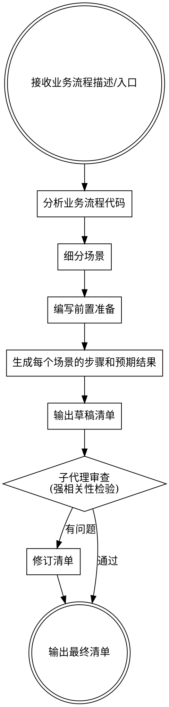

# UAT 验收清单生成技能

## 概述

为指定业务流程自动生成结构化 UAT 验收清单。通过分析代码逻辑，细分为可测试场景，并经子代理审查确保与业务流程强相关。

## 执行流程



---

## 第一步：分析业务流程代码

使用 GitNexus 或直接阅读代码，识别：

- **入口点**：触发该流程的 API、事件或用户操作
- **核心逻辑链**：主干执行路径及每个关键节点的职责
- **分支条件**：正常路径、异常路径、边界条件
- **外部依赖**：第三方服务、数据库操作、消息队列等
- **输出/副作用**：数据变更、通知、状态流转

```bash
# 推荐：使用 GitNexus 理解流程
gitnexus_query({query: "<业务流程关键词>"})
gitnexus_context({name: "<核心函数名>"})
# 或直接读取路由/服务/控制器文件
```

---

## 第二步：细分场景

将业务流程按以下维度拆分为独立可测试的场景：

| 场景类型 | 说明 | 示例 |
|---------|------|------|
| **正常路径** | 最典型的成功用例 | 用户正常完成绑定 |
| **边界条件** | 极限输入、空值、最大值 | 二维码已过期 |
| **异常路径** | 系统错误、权限不足、并发 | 网络超时后重试 |
| **业务规则** | 特定约束条件的验证 | 重复绑定检测 |
| **数据一致性** | 跨系统、跨状态的数据正确性 | 绑定后用户信息同步 |

**每个场景命名格式：** `场景 N：<动词> + <主语> + <条件>`

---

## 第三步：编写前置准备

前置准备必须具体可操作，列出以下内容：

```markdown
## 前置准备

### 环境要求
- [ ] 测试环境 URL：`https://...`
- [ ] 所需账号权限（具体角色）
- [ ] 依赖服务状态确认（如：企业微信应用已配置、数据库已初始化）

### 测试数据
- [ ] 准备测试用账号（列出具体字段/条件）
- [ ] 准备边界测试数据（如：过期二维码、已绑定账号）
- [ ] 清理脚本或回滚方式

### 工具/权限
- [ ] 测试人员权限确认
- [ ] 抓包/调试工具准备（如需）
- [ ] 数据库访问权限（用于验证数据写入）
```

---

## 第四步：生成场景步骤和预期结果

每个场景严格按以下格式输出：

```markdown
### 场景 N：<场景名称>

**目的：** 验证 <具体业务逻辑描述>

**步骤：**
- [ ] 步骤1：<具体操作> → **预期：** <具体可验证结果>
- [ ] 步骤2：<具体操作> → **预期：** <具体可验证结果>
- [ ] 步骤3：<具体操作> → **预期：** <具体可验证结果>

**通过标准：** <整体场景成功的判断依据>
```

**步骤编写规则：**
- 每个步骤必须包含"操作"和"预期结果"两部分
- 预期结果必须**具体可观测**（能看到什么、数据库写了什么、返回了什么）
- 不写模糊词：~~"系统正常响应"~~ → 写 "页面显示'绑定成功'提示，3秒后跳转至首页"
- 步骤粒度：每步只做一件事

---

## 第五步：子代理审查

生成草稿后，**必须**派遣子代理进行审查。

### 子代理 Prompt 模板

```
你是一名资深 QA 工程师，请审查以下 UAT 验收清单。

【业务流程描述】
<将第一步分析得到的流程描述填入此处>

【待审清单】
<将草稿清单全文填入此处>

请按以下维度审查，给出具体的问题列表和修改建议：

1. **强相关性**：每个场景是否真的对应业务流程中的某个节点或分支？删除与流程无关的通用测试项
2. **覆盖完整性**：流程中的哪些分支/条件没有被覆盖？列出遗漏的场景
3. **步骤可执行性**：步骤是否足够具体？测试人员能否无歧义地执行？
4. **预期结果可验证性**：预期结果是否可观测？是否需要补充数据库验证步骤？
5. **前置准备充分性**：缺少哪些必要的测试数据或环境配置？

输出格式：
- 问题列表（编号）
- 修改建议（针对每个问题）
- 总体评分（1-10分）及理由
```

### 审查后的修订要求

- 评分 < 7 分：必须修订并重新审查
- 评分 7-8 分：修订主要问题后输出
- 评分 ≥ 9 分：直接输出

---

## 输出格式规范

最终清单保存为 Markdown 文件，路径建议：`docs/uat/<业务流程名>-checklist.md`

```markdown
# <业务流程名> UAT 验收清单

**版本：** v1.0  
**创建日期：** YYYY-MM-DD  
**业务流程：** <简要描述>  
**相关代码：** <核心文件路径>

---

## 前置准备

<前置准备内容>

---

## 测试场景

### 场景 1：...
### 场景 2：...
...

---

## 验收标准

全部场景通过 = 本次业务流程验收通过
```

---

## 常见错误

| 错误 | 修正 |
|------|------|
| 场景覆盖通用功能而非业务逻辑 | 必须追溯到代码中的具体分支 |
| 预期结果写"正确显示" | 写出具体的文案、状态码、数据库字段值 |
| 跳过子代理审查 | 审查是必须步骤，不可省略 |
| 前置准备只写"准备账号" | 写明账号的具体属性和状态 |
| 场景之间有依赖但未说明执行顺序 | 在场景开头注明"依赖场景N通过后执行" |
